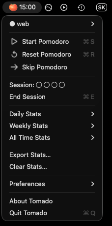

# Tomado 🍅

Simple Pomodoro Timer that lives in your macOS menu bar.



Please create a Pull Request or Issue if you encounter an error. I'm also always open to talk 🌱

## Features

- Pomodoro sessions with short and long breaks
- Configurable interval lengths, autostart, and notification sounds
- **Project tracking** — tag sessions to a named project, create/rename/delete projects from the menu
- **Stats** — daily, weekly, and all-time counts broken down by project
- **Export** — one-click CSV export to Desktop
- **Clear** — wipe stats with a confirmation prompt

## Installation

1. Download `Tomado-Installer.dmg` from the latest [release](https://github.com/mstcgalis/Tomado/releases/tag/v0.3.2) (v0.3.2)
2. Mount the `.dmg` and move Tomado to `Applications`
3. Open Tomado
4. Go to `System Settings → Privacy & Security → General → Open Anyway`
5. Enable notifications: `System Settings → Notifications → Tomado → Allow Notifications`

## Building from source

Requires Python 3.10+ (framework build) and [uv](https://docs.astral.sh/uv/).

```sh
git clone https://github.com/mstcgalis/Tomado.git
cd Tomado
uv sync
```

Tasks via [poe](https://poethepoet.natn.io/):

| Command | Description |
|---|---|
| `uv run poe alias` | Build alias app (fast, no rebuild needed on source changes) |
| `uv run poe app` | Build standalone app |
| `uv run poe run` | Launch the built app |
| `uv run poe dmg` | Create installer DMG |
| `uv run poe clean` | Remove build artifacts |

After building, allow the app via `System Settings → Privacy & Security → Open Anyway`.

---

made with ❤️, care and patience by [Daniel Gális](https://www.are.na/daniel-galis)

part of [self.governance(software)](https://www.are.na/daniel-galis/self-governance)
